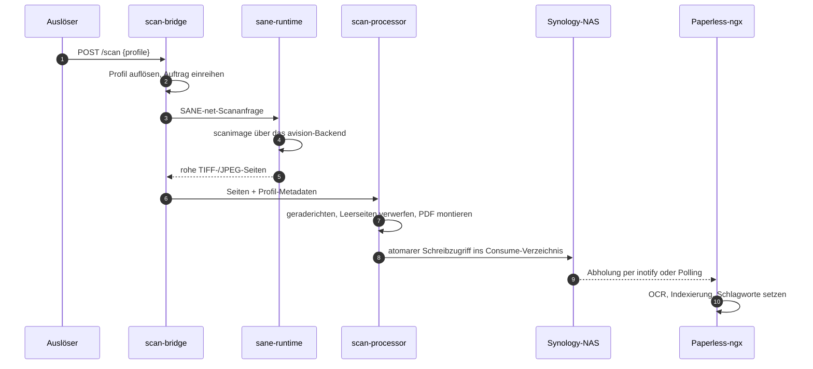

# Architektur

Drei eigene Container-Images plus übernommene Upstream-Images. Auf dem Pi
läuft nur Docker; alles Funktionale steckt in Containern.

## Komponenten

| Komponente | Aufgabe | Sprache |
| --- | --- | --- |
| `scan-bridge` | Kern-Daemon, REST-API, Profil-Dispatch, Metriken | Go |
| `sane-runtime` | SANE-Treiber, USB-Anbindung | Bash + Go |
| `scan-processor` | Bildverarbeitung, PDF-Montage, NFS-Schreibzugriff | Go |
| Paperless-ngx | DMS mit OCR, Index und Oberfläche | upstream |
| scanservjs | Optionale Weboberfläche für manuelles Scannen | upstream |

Nur die ersten drei entstehen in diesem Repository. Alles Übrige ist ein
übernommenes Upstream-Image — dieses Projekt liefert Compose-Dateien und
Konfiguration dafür, niemals einen Fork.

## Datenfluss

Alles zwischen Auslöser und fertigem PDF läuft in Containern. Nur der
USB-Geräteknoten und der NFS-Mount überqueren die Grenze zwischen Host
und Container.

Der Auslöser ist ein beliebiger HTTP-Client: eine Zigbee-Fernbedienung
über Home Assistant, ein n8n-Workflow, eine Weboberfläche oder schlicht
`curl`. Der Scanner wird über `/dev/bus/usb` auf dem Host erreicht und
per udev-Regel in `sane-runtime` hineingereicht — nie mit
`--privileged`.

## Entwurfsgrundsätze

**Container-First, dünner Host.** Der Pi bekommt Docker, einen NFS-Mount
aus `/etc/fstab` und udev-Regeln. Sonst nichts. Wenn eine Funktion eine
Installation auf dem Host zu verlangen scheint, hat die containerisierte
Variante Vorrang.

**Drei eigene Images, nicht mehr.** Disziplin beim Zuschnitt: Was es
upstream schon gibt, wird übernommen und nicht nachgebaut.

**Synology ist die einzige Wahrheit.** Der Pi ist ein Einlieferungsknoten.
Wer den Pi verliert, verliert kein Dokument.

**Keine Cloud-Abhängigkeiten im Kernpfad.** Alles funktioniert auch mit
gezogenem Internetkabel. Optionale Integrationen sind als solche
gekennzeichnet.

**Keine `latest`-Tags.** Compose-Dateien pinnen konkrete Versionen; der
Update-Bot schlägt Anhebungen vor.

## Auslösepfade

Der Scan-Endpunkt ist bewusst unabhängig von der Auslösequelle — er nimmt
einen Profilnamen entgegen und sonst nichts. Damit bleiben alle
Auslösequellen austauschbar:

- **HTTP-Webhook** — der Hauptweg, auf dem alles andere aufsetzt
- **Zigbee-Fernbedienung über Home Assistant** — ein Blueprint bildet
  Tastenpositionen auf Profile ab
- **n8n-Workflow** — der alternative Automatisierungsweg
- **Tasten am Scanner** — geräteabhängig und beim Referenzscanner nur
  teilweise verfügbar, siehe
  [die i1120-Seite](../hardware/kodak-scanmate-i1120.md)

## Speicher

Unterstützt werden drei Topologien mit unterschiedlichem Verhalten bei
Latenz und Sicherung. Der Vergleich steht unter
[Speichertopologien](storage-topologies.md).

## Datenschutz der Dokumentations-Site

Die Site selbst folgt derselben Cloud-Regel: Sie stellt keine Anfragen an
Dritte. Mermaid wird selbst gehostet statt von einem CDN geladen, und
Google Fonts ist abgeschaltet. Siehe
[Keine Drittanbieter-Anfragen](no-third-party-requests.md).

## Weiterführend

Die vollständige Architekturdiskussion — einschließlich Backup-Architektur,
Haltung zu Hochverfügbarkeit und Zusammenfassung des Bedrohungsmodells —
steht auf Englisch in
[`ARCHITECTURE.md`](https://github.com/strausmann/paperless-scan-bridge/blob/main/ARCHITECTURE.md)
im Repository.
