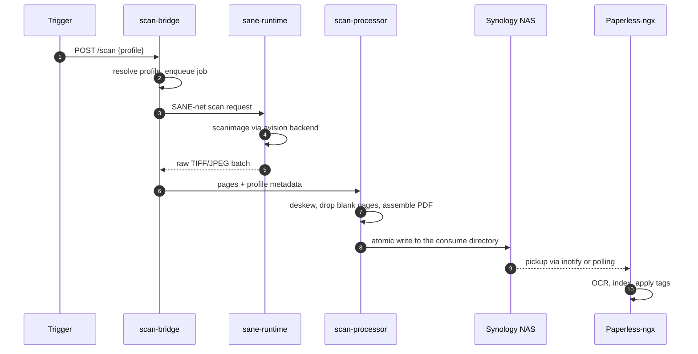

# Architecture

Three custom container images plus adopted upstream images. The Pi runs
only Docker; everything functional lives in containers.

## Components

| Component | Role | Language |
| --- | --- | --- |
| `scan-bridge` | Core daemon, REST API, profile dispatch, metrics | Go |
| `sane-runtime` | SANE drivers, USB integration | Bash + Go |
| `scan-processor` | Image processing, PDF assembly, NFS write | Go |
| Paperless-ngx | DMS with OCR, indexing, UI | upstream |
| scanservjs | Optional manual scanning web UI | upstream |

Only the first three are built in this repository. Everything else is an
adopted upstream image — this project ships compose files and
configuration for them, never forks.

## Data flow

Everything between the trigger and the final PDF is containerized. Only
the USB device node and the NFS mount cross the host-container
boundary.

The trigger is any HTTP client: a Zigbee remote routed through Home
Assistant, an n8n workflow, a web UI, or plain `curl`. The scanner is
reached through `/dev/bus/usb` on the host, passed into `sane-runtime`
by a udev rule — never with `--privileged`.

## Design principles

**Container-first, host-thin.** The Pi gets Docker, an NFS mount from
`/etc/fstab`, and udev rules. Nothing else. If a feature appears to need
a host-level installation, the containerized alternative is preferred.

**Three custom images, no more.** Scope discipline: anything that
already exists upstream is adopted, not rebuilt.

**Synology is the single source of truth.** The Pi is an ingestion node.
Losing the Pi loses no documents.

**No cloud dependencies on the core path.** Everything works with the
network cable to the internet unplugged. Optional integrations are
labelled as such.

**No `latest` tags.** Compose files pin specific versions; the update
bot proposes bumps.

## Trigger paths

The scan endpoint is deliberately trigger-agnostic — it accepts a
profile name and nothing else. That keeps every trigger source
interchangeable:

- **HTTP webhook** — the primary path, and what everything else is built
  on
- **Zigbee remote via Home Assistant** — a blueprint maps button
  positions to profiles
- **n8n workflow** — the alternative automation path
- **Hardware scanner buttons** — device-dependent and, on the reference
  scanner, only partially available; see
  [the i1120 page](../hardware/kodak-scanmate-i1120.md)

## Storage

Three topologies are supported, each with different latency and backup
characteristics. See
[Storage topologies](storage-topologies.md) for the comparison.

## Privacy of the documentation site

The site itself follows the same no-cloud rule: it makes no third-party
requests. Mermaid is self-hosted instead of loaded from a CDN and Google
Fonts is off. See
[No third-party requests](no-third-party-requests.md).

## Further reading

The full architectural discussion, including the backup architecture,
the high-availability stance, and the threat-model summary, lives in
[`ARCHITECTURE.md`](https://github.com/strausmann/paperless-scan-bridge/blob/main/ARCHITECTURE.md)
in the repository.
