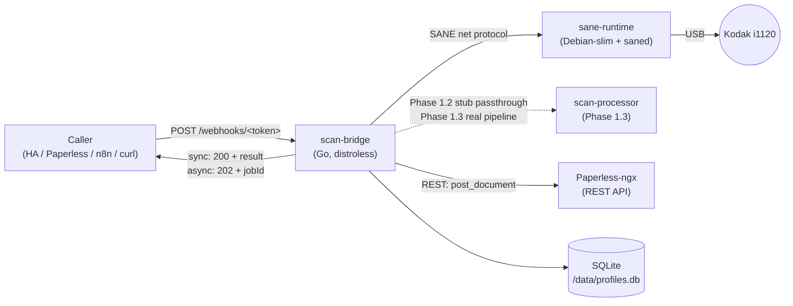

# Phase 1.2 Design — Webhook-Driven Scan Architecture

**Date:** 2026-04-30
**Status:** Draft for review
**Phase:** 1.2 (`scan-bridge` daemon + `sane-runtime` container)
**Supersedes:** Earlier informal sketches in `CONCEPT.md` regarding hardware
button triggers — see *Background* for the empirical findings that
motivated the redesign.

## Goal

Deliver the first end-to-end scan path: **a remote caller (Home
Assistant, Paperless-ngx button, n8n, curl) triggers a scan via HTTP
webhook, and a finished document lands in Paperless-ngx via its REST
API.** Phase 1.2 ships a working flow without OCR / image processing —
those are Phase 1.3 (`scan-processor`).

## Scope

### In scope for Phase 1.2

- `scan-bridge` Go daemon with HTTP API and SQLite-backed profile DB
- `sane-runtime` container: SANE drivers + `scanimage` CLI + `saned`
  network daemon. **No `scanbd`** (see Background)
- Webhook endpoint per profile (`POST /webhooks/<token>`)
- Synchronous *and* asynchronous response modes (per-profile default,
  caller can override)
- Output dispatch via Paperless-ngx REST API
  (`POST /api/documents/post_document/`)
- Profile schema covers SANE parameters, Paperless metadata, splitting
  strategy, tag-merge strategy, output targets
- Job queue (in-memory, single-worker) serializing scans (the scanner
  is a single physical resource)
- Secret loading via Docker secrets, env vars, or SOPS-encrypted files
- Health-check endpoint and basic Prometheus `/metrics`
- CI: Go unit tests, container build, integration test against a mocked
  SANE backend

### Explicitly out of scope for Phase 1.2

- **Image processing pipeline** (deskew, blank-page detection, QR
  decode, OCR, PDF assembly) — Phase 1.3 (`scan-processor`)
- **Web UI** for profile CRUD — Phase 1.4. Phase 1.2 ships a CRUD HTTP
  API that the future UI consumes. Profiles can be authored manually
  in YAML and imported via the API
- **Hardware triggers** (`scanbd`, indicator-button, paper-detection) —
  blocked by SANE backend limitations (see Background). Returns in a
  later phase only after the Research Track yields a working detection
  path
- **Home Assistant native integration** — Phase 2.x. Phase 1.2 lays the
  metric / API groundwork so HA integration can later attach without
  changes to the daemon
- **Multiple physical scanners** — Phase 1.2 assumes exactly one device
- **Authentication beyond per-profile token** (no user system, no RBAC) —
  Phase 2.x

## Background — empirical findings (2026-04-30)

A full day of hardware testing on the reference Kodak ScanMate i1120
established the following constraints:

| Hardware action | Detectable via SANE / `avision` backend? |
|-----------------|------------------------------------------|
| Indicator-button press (1–9) | Yes, via `--message` field as `<n>:button1` |
| Start (Scan) button press | **No** — backend exposes no signal |
| Paper insertion / removal in ADF | **No** — backend exposes no signal |
| NVRAM metadata (serial, firmware, scan counter) | Yes, via `--nvram-values` |

Test artifacts are documented in `docs/research/scanner-hardware-events.md`
(separate document) and reproduced via the test scripts on the reference
node `hhplex01`.

**Implication:** the classic hands-free pattern *"insert paper → scanner
auto-scans"* is not achievable with this backend / hardware
combination today. Phase 1.2 therefore commits to webhook triggering as
the only mechanism. Hardware re-entry is gated on the Research Track
(see end of document).

## High-level architecture



Two containers, one well-defined network protocol between them
(`saned`'s SANE net protocol on TCP/6566). `scan-bridge` is the only
daemon callers ever talk to; `sane-runtime` is private to the
deployment.

## Component contracts

### `scan-bridge`

**Image:** `gcr.io/distroless/static-debian12` base, single Go binary
(`go build -tags netgo -ldflags '-s -w'`).

**Responsibilities:**

- HTTP server on port 8080 (configurable)
- Token-based webhook routing
- Profile CRUD API
- SANE-net protocol client (Go, talks to `saned` on TCP/6566 — no
  shell-out, no `scanimage` CLI on the `scan-bridge` side; this keeps
  the binary distroless. See *Implementation note* below)
- Job queue (in-memory, single worker)
- Output dispatch (Paperless-ngx REST client)
- Prometheus metrics
- Health-check endpoint (`/healthz` liveness, `/readyz` readiness
  including SANE-net reachability)

**Persistent state:** SQLite at `/data/profiles.db` (volume-mounted).

**Dependencies it talks to:**

- `sane-runtime:6566` (SANE net protocol)
- Paperless-ngx REST API (URL configurable per output target)

### `sane-runtime`

**Image:** `debian:12-slim` + `sane-utils` + `libsane-extras` (only
`avision` backend enabled in `dll.conf` — image-slimming verified
during smoke tests).

**Responsibilities:**

- Run `saned` listening on TCP/6566 (firewalled to internal Docker
  network)
- Provide `scanimage` and supporting binaries
- USB device exposure via `--device /dev/bus/usb` (no `--privileged`
  required — verified during smoke tests)

**Persistent state:** none. Stateless. Restart-safe.

**Notable absence:** **`scanbd` is not installed in Phase 1.2.** It was
evaluated in detail and confirmed unable to detect the Start button or
paper-insert events. Without those signals, scanbd offers no value over
direct webhook calls. Re-introduction is conditioned on Research Track
outcomes.

### Implementation note: how `scan-bridge` actually invokes SANE

Three paths were considered. Phase 1.2 picks the first:

1. **Selected — pure SANE-net protocol from Go.** `scan-bridge`
   contains a small Go SANE-net client (existing third-party library
   if available, otherwise hand-rolled — the protocol is simple,
   well-documented, plain TCP). It opens a session against
   `sane-runtime:6566`, sets options, reads pages. **No process spawn,
   no CLI, no CGO.** The `scan-bridge` image stays distroless and
   cross-compiles cleanly to ARM64.
2. Rejected: shelling out to `scanimage` via `docker exec` into
   `sane-runtime`. Tight coupling between containers, requires Docker
   socket access, defeats distroless.
3. Rejected: full CGO bindings to `libsane` inside `scan-bridge`.
   Defeats distroless, complicates cross-compile to ARM64, no clear
   benefit over option 1.

The **TBD that option 1 carries** is which Go SANE-net library to use.
A short evaluation in the implementation plan picks between
hand-rolled vs. an existing library; the choice does not affect the
spec's contracts. Tracked as **open question O-5**.

## Webhook API

### URL structure

```
POST https://scan.<deployment-domain>/webhooks/<token>
```

- `<token>` is a 32-byte URL-safe random secret, generated when the
  profile is created and stored in the SQLite DB
- Token uniquely identifies the profile *and* authorises the call
- Token rotation: web UI (Phase 1.4) and CRUD API both support
  regenerating; old token is invalidated immediately on rotation

### Request

#### Production form (recommended)

```
POST /webhooks/<token>
Content-Type: application/json

{
  "filename": "vodafone-rechnung-{date}.pdf",
  "tag_ids": [7, 9],
  "tag_strategy": "add",
  "correspondent_id": 12,
  "document_type_id": 3,
  "owner_id": 1,
  "archive_serial_number": 20260042,
  "response_mode": "async"
}
```

All body fields are optional. They override profile defaults for this
call only. Field semantics:

| Field | Type | Behaviour |
|-------|------|-----------|
| `filename` | string template | Overrides profile naming pattern. Supports `{date}`, `{time}`, `{counter}`, `{profile}`. Becomes the multipart `document` filename sent to Paperless. The Paperless `title` field is **not** set in Phase 1.2 |
| `tag_ids` | array of integers | Paperless tag IDs for this scan (see `tag_strategy`). **IDs only** — Phase 1.2 does not auto-resolve names |
| `tag_strategy` | `"add"` \| `"override"` \| `"remove"` | How `tag_ids` interact with profile defaults. Strategies operate on the local effective set **before** upload — no Paperless post-processing |
| `correspondent_id` | integer | Paperless correspondent ID. `0` or `null` clears the field |
| `document_type_id` | integer | Paperless document type ID. `0` or `null` clears the field |
| `owner_id` | integer | Paperless user ID for owner. `null` leaves it unset |
| `archive_serial_number` | integer | Force-set ASN for the *first* document of the scan. Paperless's `archive_serial_number` is numeric — pass an integer here, not a label string |
| `response_mode` | `"sync"` \| `"async"` | Overrides profile default |

#### Convenience form (test / simple HA automations)

```
POST /webhooks/<token>?response_mode=async&tags=Vodafone,2026-Q2
```

Query parameters with the same names as JSON body fields are accepted.
Body and query parameters merge; body wins on conflict. Useful for
pure-URL configuration in low-flexibility callers (some HA shortcuts,
shell scripts).

### Response

#### Synchronous (`response_mode=sync`)

The HTTP connection stays open until all documents are scanned,
processed, **uploaded to Paperless, and Paperless consumption has
finished** (see *Paperless upload semantics* below for what that
involves). Response shape:

```json
{
  "scanId": "scan-01HXYZ...",
  "profile": "rechnungen",
  "documents": [
    {
      "paperlessTaskId": "f5e3...8a2c",
      "paperlessDocId": 4711,
      "archive_serial_number": 20260042,
      "pages": 3,
      "filename": "vodafone-rechnung-20260430.pdf",
      "tag_ids": [3, 7, 9]
    }
  ],
  "durationMs": 27834,
  "warnings": []
}
```

`paperlessTaskId` is always present after a successful upload;
`paperlessDocId` is present when Paperless consumption has
completed. In sync mode both are populated. `warnings` carries
non-fatal observations such as "Paperless consumption took
longer than expected" or "ADF reported jam, recovered".

#### Asynchronous (`response_mode=async`)

Immediate response:

```json
{
  "scanId": "scan-01HXYZ...",
  "status": "queued",
  "statusUrl": "/scans/scan-01HXYZ..."
}
```

HTTP code: `202 Accepted`. The caller polls `GET /scans/<scanId>` for
progress:

```json
{
  "scanId": "scan-01HXYZ...",
  "status": "queued" | "scanning" | "processing" | "uploading" | "paperless_consuming" | "done" | "failed",
  "stage": "scan" | "process" | "upload" | "paperless-consume" | null,
  "progress": 0.6,
  "documents": [...],
  "error": null
}
```

Optional: profiles can declare a `callback_url`. When set, the daemon
POSTs the final result there on completion (fire-and-forget; if the
callback fails, the scan still completed — callers must use the
poll-status fallback).

### Error semantics

| Code | Meaning | Body |
|------|---------|------|
| `400` | Invalid JSON / unknown query parameter / invalid `tag_strategy` | `{ "error": "...", "field": "..." }` |
| `401` | Unknown token (profile not found or rotated) | `{ "error": "unauthorized" }` |
| `409` | Job-queue conflict (e.g. profile is currently disabled, or scanner held by another scan) — only relevant in sync mode; async returns `202` and queues | `{ "error": "...", "retryAfter": 30 }` |
| `500` | Internal error (DB failure, panic) | `{ "error": "internal", "scanId": "..." }` |
| `502` | Hardware error (scanner disconnected, SANE-net unreachable) | `{ "error": "hardware-unreachable" }` |
| `503` | Paperless API unreachable | `{ "error": "paperless-unreachable" }` |
| `504` | Sync mode timed out (very long scan + processing). Caller should switch to async mode for that profile | `{ "error": "timeout", "scanId": "...", "statusUrl": "/scans/..." }` |

A scan that started before failing produces a `scanId` even when the
final response is an error. This lets callers reconcile state via
`/scans/<scanId>` regardless of what the immediate response said.

## Paperless upload semantics

Paperless-ngx ingests documents **asynchronously** via a Celery task
queue. `POST /api/documents/post_document/` returns HTTP 200 with a
**task UUID string** as body — the document does not yet exist in the
Paperless DB. Polling `GET /api/tasks/?task_id=<uuid>` reveals the
task's lifecycle (`PENDING` → `STARTED` → `SUCCESS` or `FAILURE`).
On `SUCCESS`, the task body carries the new `related_document` (the
Paperless document ID) which the scan-bridge response surfaces as
`paperlessDocId`.

### Implications for the bridge

1. **Sync mode** (`response_mode=sync`) waits until the Paperless task
   reports `SUCCESS` (or `FAILURE`) before returning. The response
   contains both `paperlessTaskId` and `paperlessDocId`. Maximum
   wait is the same five-minute connection cap that already covers
   the rest of the scan path; if Paperless consumption alone takes
   longer, the response is `504 timeout` with the `scanId` to keep
   polling.
2. **Async mode** (`response_mode=async`) returns `202` immediately
   with the `scanId`. The job's `status` cycles through
   `queued → scanning → processing → uploading → paperless_consuming
   → done` (or `failed` with `stage=paperless-consume` when consumption
   errors). `paperlessTaskId` becomes available once the upload has
   succeeded; `paperlessDocId` once Paperless reports `SUCCESS`.
3. **Failure handling.** A Paperless task that ends in `FAILURE`
   maps to `failed` with `stage=paperless-consume` and the
   Paperless task's error message in the scan's `error` field. The
   scanned PDF is preserved in the queue's result for manual recovery
   (Phase 2.x: an admin endpoint to re-upload a stored PDF; Phase 1.2
   ships a structured log line with enough context to recover by
   hand).

### Polling cadence

To keep load on Paperless reasonable, scan-bridge polls
`/api/tasks/?task_id=<uuid>` with exponential back-off starting at
`500ms`, doubling up to `5s`, capped at the five-minute total.
Paperless's task list endpoint is fast (single row by UUID) so this
is gentle.

### Decision Δ-1 — IDs in the profile, not names

The persisted profile schema and the webhook body use **Paperless
integer IDs** for `correspondent`, `document_type`, `owner`, and
`tag` references. The Paperless REST API expects IDs at upload, and
auto-resolution from names introduces several failure modes
(missing entity, ambiguous duplicates, race with web UI changes).

For Phase 1.2 the bridge does not auto-create correspondents,
document types, or users. The Web UI in Phase 1.4 will offer
name-based selection that calls Paperless to resolve to IDs at
edit time. The YAML import endpoint (Phase 1.2) accepts an
optional convenience syntax `correspondent_name: "Vodafone GmbH"`
that is resolved to `correspondent_id` exactly once at import
time — if the name is missing or ambiguous, the import fails with
a clear error. Once stored, only IDs remain.

### Decision Δ-2 — ASN is integer

Paperless's `archive_serial_number` is an integer column. The
webhook body, the profile schema, and the response shape all
treat it as integer. A "label format" like `ASN-2026-0042` is
purely a sticker-printing convention and lives outside this
schema; any decoder that produces such labels must extract the
numeric portion before calling the bridge.

### Decision Δ-3 — Per-scan job persistence

The async-mode contract requires `/scans/<scanId>` to remain
queryable across daemon restarts. The job queue itself stays
in-memory (Phase 1.2 simplicity), but each job's lifecycle is
mirrored to a `scan_jobs` SQLite table with columns
`(scan_id, profile_id, status, stage, created_at, updated_at,
error, result_json)`. On daemon start, a janitor sweeps any row
in a non-terminal state to `failed` with
`error="daemon-restarted"`. This makes async mode robust without
introducing a persistent queue.

## Profile model

Profiles are the central first-class object. Each profile encodes:

```yaml
# Conceptual schema; SQLite stores normalised columns + JSON for the
# nested fields (SQLite JSON1 extension)

id: 01HXYZ-ULID                   # immutable
name: "Rechnungen"                # human-readable, editable
token: "k7m9-pQrS-tUvW-xYz2A4..."  # URL-safe random, regeneratable
enabled: true

# How the scanner is driven
scan:
  mode: "Gray"                     # SANE: Lineart | Gray | Color
  resolution: 300
  source: "ADF Front"              # SANE: ADF Front | ADF Duplex
  brightness: 0
  contrast: 0

# How a stack of scanned pages becomes one or many documents
splitting:
  asn_mode: "required"             # required | disabled
  asn_page_handling: "discard"     # discard | keep — only relevant when asn_mode=required
  on_missing_first_asn: "auto-create"  # auto-create | error — only required mode
  blank_threshold: 0.95            # only disabled mode (fraction of pixels above brightness threshold)

# Defaults applied to each document, overridable per call.
# All references are Paperless **integer IDs** — names are not stored
# in the persisted profile (decision Δ-1, see "Paperless upload
# semantics" below).
paperless:
  default_tag_ids: [3, 7]          # Paperless tag IDs
  default_tag_strategy: "add"      # add | override | remove
  correspondent_id: 12             # Paperless correspondent ID, or null
  document_type_id: 3              # Paperless document-type ID, or null
  owner_id: 1                      # Paperless user ID, or null

# Output naming
naming:
  pattern: "{date}_{profile}_{counter}.pdf"

# Where the documents go (list — multi-output future-proof)
outputs:
  - target: "paperless-api"
    api_url: "https://paperless.<domain>"
    api_token_secret: "paperless_api_token"  # name of Docker secret / env var

# Response behaviour
response:
  default_mode: "sync"             # sync | async
  callback_url: null               # optional async fire-and-forget POST

# Optional metadata for ops / future HA integration
metadata:
  description: "Eingehende Rechnungen — OCR + ToReview Tag"
  created_at: "2026-04-30T15:00:00Z"
  modified_at: "2026-04-30T15:00:00Z"
  scan_count_total: 0              # incremented by daemon
```

### Splitting logic — formal

```
input:  pages = [p1, p2, ..., pN]
        profile.splitting.asn_mode ∈ {required, disabled}
output: documents = [{pages: [...], asn, ...}, ...]
```

#### `asn_mode = required`

```
Find QR codes on each page. Group:
  * page with QR  →  starts a new document (its asn = QR content)
  * page without QR  →  belongs to the current document

Edge case — first page has no QR:
  if profile.splitting.on_missing_first_asn = "auto-create":
    request a new ASN from Paperless (see "Paperless ASN integration")
    open synthetic document with that ASN, accumulate pages until next QR
  else (= "error"):
    fail the scan, return scanId in error response

Edge case — QR page handling:
  if profile.splitting.asn_page_handling = "discard":
    QR page is the marker only, not part of document content
  else (= "keep"):
    QR page is page 1 of the document
```

#### `asn_mode = disabled`

```
Find blank pages (mean pixel intensity above blank_threshold). Group:
  * blank page  →  ends current document; starts new document at next non-blank
  * non-blank page  →  belongs to current document

Blank pages are always discarded (their function is to separate, not
to be content).

Edge case — stack with no blank pages:
  whole stack = single document, profile.paperless.* defaults apply
```

### Paperless ASN integration

Paperless-ngx stores ASN as a numeric field on documents
(`archive_serial_number`). It does not currently (as of the docs we
checked) expose a "reserve next ASN" endpoint. **Phase 1.2 implements
ASN as follows:**

1. When `asn_mode=required` and the QR carries a valid ASN, that value
   is sent to Paperless on upload as `archive_serial_number`.
2. When `on_missing_first_asn=auto-create`, `scan-bridge` calls
   `GET /api/documents/?ordering=-archive_serial_number&page_size=1`
   to find the highest existing ASN, increments it, and uses that
   value. **This must be done inside the same scan-job critical section**
   to avoid races between concurrent scans (the job queue serialises,
   so this is naturally safe in Phase 1.2).
3. Spec TBD: investigate whether Paperless's barcode/ASN settings can
   be reused, or whether scan-bridge should maintain its own ASN
   counter as fallback. Tracked as **open question O-1** (see end).

## Container layout and deployment

```yaml
# deploy/compose/scan-stack.compose.yml (sketch)
services:
  scan-bridge:
    image: ghcr.io/strausmann/paperless-scan-bridge/scan-bridge:0.1.0
    restart: unless-stopped
    ports:
      - "8080:8080"
    volumes:
      - scan-bridge-data:/data
    environment:
      SANE_NET_HOST: sane-runtime:6566
      LOG_LEVEL: info
    secrets:
      - paperless_api_token

  sane-runtime:
    image: ghcr.io/strausmann/paperless-scan-bridge/sane-runtime:0.1.0
    restart: unless-stopped
    devices:
      - /dev/bus/usb
    expose:
      - "6566"  # SANE-net, internal only

volumes:
  scan-bridge-data:

secrets:
  paperless_api_token:
    file: ./secrets/paperless_api_token  # or external: true for swarm
```

The `sane-runtime` container is intentionally not exposed to the host
network. SANE-net protocol is unauthenticated; the threat model
relies on Docker network isolation.

## Storage choice — SQLite

**SQLite (with JSON1 extension) chosen** over alternatives:

- Embedded — no separate DB container
- Single file — trivial backup (restic, bind mount, tar)
- ACID — no half-written profile rows during web-UI edits (Phase 1.4)
- JSON1 lets nested `scan: {...}` and `outputs: [...]` live as JSON
  fields; flat fields stay normalised for fast token lookup
- The expected scale (tens of profiles, low write rate) is far below
  SQLite limits

Migration tool: `golang-migrate` style, schema versions in
`components/scan-bridge/internal/db/migrations/`.

## Job queue and concurrency

**Single-worker, in-memory queue.** The Kodak i1120 (and most ADF
scanners) cannot do two jobs simultaneously — physical resource
contention forces serialisation upstream of the SANE call.

Behaviour:

- Each webhook call enqueues a job with a generated `scanId`
- The single worker pops jobs FIFO
- Sync-mode callers wait on a `chan` keyed by `scanId`
- Async-mode callers immediately get `202 + scanId` and poll
- On daemon restart: in-flight scans are lost; sync callers see
  connection drop, async callers see the scan stay at `queued` forever
  (a TTL-based janitor reaps these on next start). **This is acceptable
  for Phase 1.2.** Persistent queue is Phase 2.x.

Queue capacity: configurable, default 16 (rejected requests get
`503` with `retryAfter`).

## Secrets

Per AGENTS.md (`Secrets: SOPS with age keys`) and the
multi-deployment-style needs of an open-source project, three loading
mechanisms are supported in priority order:

1. **Docker secrets** — file under `/run/secrets/<name>` (preferred for
   compose / swarm). Profile schema uses *names*, not values:
   `api_token_secret: "paperless_api_token"`
2. **Environment variables** — `PAPERLESS_API_TOKEN=...` for simple
   deployments, dev loops, container-orchestrator without secrets
   plumbing
3. **SOPS-encrypted file** — pointed at via env
   `SCAN_BRIDGE_SECRETS_FILE=/etc/scan-bridge/secrets.sops.yaml`,
   decrypted at startup using age key in
   `SCAN_BRIDGE_AGE_KEY_FILE`. Daemon never touches plaintext on disk

The daemon resolves a secret reference by trying these sources in
order. First hit wins. **Plaintext secrets in profile YAML are rejected
at parse time.**

## Observability

### Logging

JSON structured logs to stdout (`zerolog` or `slog`).

Levels: `error`, `warn`, `info`, `debug`. Default `info`.

Per-scan correlation: every log line for a job carries `scanId`. Caller
can grep logs with the `scanId` from the response.

### Metrics

Prometheus exposition on `:8080/metrics`:

- `scan_bridge_scans_total{profile, status}` (counter)
- `scan_bridge_scan_duration_seconds{profile, stage}` (histogram;
  stages: scan, process, upload)
- `scan_bridge_documents_produced_total{profile}` (counter — usually 1
  per scan, but with QR-splitting can be N)
- `scan_bridge_queue_depth` (gauge)
- `scan_bridge_paperless_uploads_total{result}` (counter)
- `scan_bridge_sane_errors_total{type}` (counter)

These metrics are sufficient for the Phase 2.x HA integration to build
its sensor entities directly.

### Tracing (TBD)

OpenTelemetry instrumentation considered nice-to-have, not required
for Phase 1.2. **Tracked as open question O-2.**

## Testing strategy

### Unit tests (Go)

- Profile validation (split-mode mutex, tag-strategy enums, token
  format)
- Tag-merge logic (`add` / `override` / `remove`, profile-default vs
  per-call override matrix — match the table in this spec)
- Webhook routing
- SQLite migrations (apply, rollback, idempotency)
- Splitting decision tables (mocked page-list inputs, asserted document
  groupings)

### Integration tests (compose)

`tests/integration/` brings up:

- `scan-bridge` (real binary)
- `sane-runtime` (real container, *but* with a mocked SANE backend that
  returns canned PNMs — `sane-mock` upstream image, or a minimal
  in-house mock)
- A mock Paperless-ngx (HTTP server returning fake `document_id`s and
  recording requests for assertion)

Test scenarios:

1. Sync webhook: scan, single doc, ASN-mode disabled, no blank pages
   → 1 Paperless upload, 200 with `documents: [{...}]`
2. Sync webhook: scan, ASN-mode required, mocked pages with QR
   markers → N Paperless uploads
3. Async webhook: 202, poll `/scans/<id>` until done
4. Token rotation invalidates old token (401)
5. Paperless unreachable → 503 with retryAfter
6. Multiple concurrent webhooks → serialised, queue depth metric
   reflects pending count

### Hardware-loop tests (manual)

Phase 1.2 ships a `make test-hardware` target that requires a real
scanner on the test host. Documented in
`docs/development/hardware-testing.md`. **Not part of CI** — runs
locally only.

## Implementation outline

A separate implementation plan (output of the writing-plans skill) will
expand this into ordered tasks. Sketch only here:

1. `components/sane-runtime/` Dockerfile (Debian-slim + sane-utils +
   saned config; backend pruning to `avision`-only)
2. `components/scan-bridge/` Go module skeleton, distroless Dockerfile
3. SQLite schema + migrations
4. Profile CRUD API (`GET/POST/PUT/DELETE /api/profiles`)
5. Webhook router (`POST /webhooks/<token>`)
6. Job queue (single worker)
7. SANE-net client integration
8. Output dispatcher abstraction + Paperless-ngx implementation
9. Tag-merge logic
10. Splitting placeholder (passes pages through as one document — real
    splitting lives in Phase 1.3 `scan-processor`)
11. Health + metrics
12. Compose stack + secret wiring
13. Tests (unit + integration)
14. CI pipeline (build, test, multi-arch image push to GHCR)
15. Initial documentation pages on `docs/site/` (Zensical) for getting
    started + webhook reference

## Future phases — what 1.2 enables

- **1.3 — `scan-processor`:** real image pipeline (deskew, blank-page,
  QR decode via ZXing-Go or gozbar, OCR via tesseract, multi-page PDF
  via `pdfcpu`). 1.2 includes a **stub processor** that just bundles
  PNMs into a single PDF — replaceable by 1.3 without touching the
  webhook contract
- **1.4 — Web UI:** Vue or Svelte UI consuming the profile CRUD API
  shipped in 1.2; no new daemon endpoints needed
- **2.x — Home Assistant integration:** custom_component reading
  `/metrics` for sensors, calling the CRUD/webhook API for services,
  optionally subscribing to a future `/events` SSE stream
- **2.x — Hardware re-introduction:** depends on Research Track
  outcomes; the webhook contract stays unchanged, hardware just
  becomes another caller of the same endpoints

## Research Track (parallel to Phase 1.2)

The findings in *Background* answered "what does SANE expose today" but
left "what does the hardware actually send" open. A parallel
investigation, tracked as a separate GitHub issue, captures and extends
this:

- **Capture:** `usbmon` + Wireshark on a Linux host while pressing each
  hardware button and inserting / removing paper. Diff against the
  same actions performed under the manufacturer's Windows driver
  (captured on a Windows VM with USBPcap).
- **Goal:** establish whether the i1120 transmits Start-button or
  paper-sensor signals on the USB bus that the `avision` SANE backend
  simply doesn't decode. If yes → an upstream patch to `sane-backends`
  becomes a real option.
- **Deliverables:**
  - `docs/research/scanner-hardware-events.md` — findings document
  - GitHub issue `Research: Hardware-Event-Detection beyond SANE`
  - If positive findings: a tracking issue for the upstream contribution
- **Decoupled from Phase 1.2:** the spec above stands regardless of
  research outcome. Hardware-trigger re-entry is purely additive.

## Open questions

- **O-1.** Does Paperless-ngx expose a "reserve next ASN" API call, or
  must `scan-bridge` derive next-ASN from `?ordering=-archive_serial_number`?
  Verify before implementing the auto-create branch in
  `splitting.on_missing_first_asn`.
- **O-2.** OpenTelemetry tracing — desirable for Phase 1.2 or
  defer? Currently leaning *defer* to keep dependency surface small.
- **O-3.** Token storage — plain in SQLite, or hashed with a constant-
  time compare on lookup? Phase 1.2 ships **plain** for simplicity
  (the SQLite file is already a sensitive artifact at deployment-secret
  level), but document the threat model and gate any future move to
  hashing on a security review.
- **O-4.** Should the `sane-runtime` container expose `saned` over a
  Unix socket instead of TCP/6566 (reducing attack surface)? Slight
  Go-side complication. Leaning toward TCP for simplicity, revisit if
  threat-model review flags it.
- **O-5.** Which Go SANE-net implementation — pick an existing
  third-party library (need to evaluate stability, license, ARM64
  support) or hand-roll the SANE-net protocol (well-documented, plain
  TCP, but more LOC). Decided in the implementation plan, not this
  spec.

## Acceptance criteria for Phase 1.2

The phase is "done" when:

- [ ] A profile can be created via the CRUD API
- [ ] A webhook call to that profile's URL produces a Paperless
      document and returns the doc-id (sync) or yields a polling URL
      (async) — verified end-to-end in a compose-based integration test
- [ ] Tag-merge matrix passes the unit-test table from this spec
- [ ] Every status code in the *Error semantics* table (400, 401,
      409, 500, 502, 503, 504) is reachable in tests and produces the
      documented response shape
- [ ] Paperless API token is loaded from at least two of: Docker
      secret, env var, SOPS file
- [ ] Multi-arch images (`linux/amd64` + `linux/arm64`) build in CI
      and are pushed to GHCR on tag
- [ ] Documentation pages (Zensical) exist for "Getting Started",
      "Webhook reference", "Profile schema reference"
- [ ] At least one manual hardware-loop run on the reference scanner
      produces a Paperless document end-to-end
