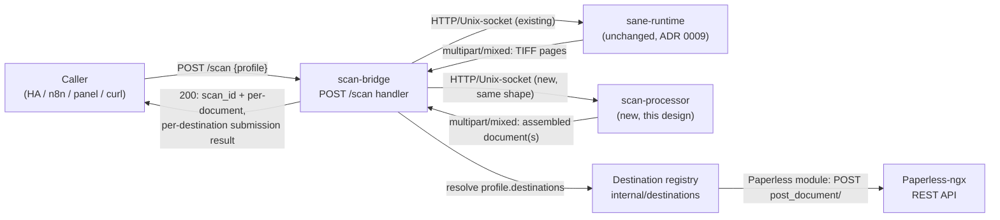
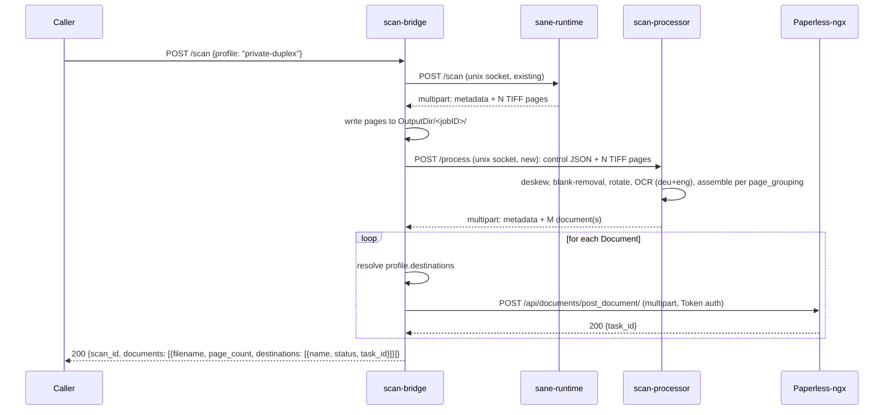

# Scan→Paperless Upload Pipeline — Design

- **Date:** 2026-08-13
- **Status:** Draft — for operator review before implementation starts
- **Depends on:** ADR [0003](../decisions/0003-three-custom-images.md) (exactly three images),
  ADR [0016](../decisions/0016-destination-routing-pluggable-interface.md) (destination registry),
  ADR [0017](../decisions/0017-document-assembly-and-type-taxonomy.md) (page-grouping + doc-type
  taxonomy), ADR [0009](../decisions/0009-bridge-sane-unix-socket.md) (Unix-socket transport
  precedent), ADR [0010](../decisions/0010-profiles-declarative-yaml.md) (declarative profiles),
  ADR [0013](../decisions/0013-container-hardening-baseline.md) (container hardening),
  ADR [0011](../decisions/0011-no-latest-pinned-versions.md) (pinned versions).
- **Extends/reconciles:** `docs/superpowers/plans/2026-04-30-phase-1.2-webhook-architecture.md`
  Task 10 (Paperless dispatcher) and Task 11 (scan-processor stub), and the "Paperless upload
  semantics" + Decision Δ-1/Δ-2/Δ-3 sections of
  `docs/superpowers/specs/2026-04-30-phase-1.2-webhook-architecture-design.md` — those decisions
  predate ADR 0016/0017's destination-registry model and are **not implemented in the current
  code**, but their reasoning about Paperless's async upload semantics and ID-based (not
  name-based) profile references still holds and is reaffirmed below.
- **Scope of this document:** Paperless-ngx as the first and only destination built in v1. NFS,
  SMB, fileee, and generic-HTTP-POST are designed as registry slots (interface + package layout)
  but **not implemented** here — they are explicit follow-up tasks, gated on the open sub-questions
  noted throughout (see "Open sub-questions carried forward").
- **Not in scope:** any code. This document is design + task breakdown + flagged decisions only.

## 1. Grounding — what exists today (verified against `main`, not the aspirational docs)

`CONTAINER_SUITE.md` and `ARCHITECTURE.md` describe a fuller pipeline (sane-runtime → shared
volume → scan-processor watching via inotify → callback to scan-bridge → NFS consume directory)
than what is actually built. The real, current flow is simpler and is the one this design extends:

- `POST /scan {profile}` (`components/scan-bridge/internal/api/scan.go`) is **fully synchronous**
  today. It resolves the profile, calls `dispatch.Client.Dispatch()`, and returns the result
  inline as `200 OK`. This is a documented, deliberate deviation from the originally planned async
  `202`/job-polling flow (see the file's own doc comment) — `jobs.go` declares the `Store`
  interface and state machine but has **no implementation**; `GET /jobs*` all return `501`.
- `dispatch.Client` (`components/scan-bridge/internal/dispatch/`) talks to `sane-runtime` over
  **HTTP on a Unix-domain socket** (ADR 0009, realized). The wire shape is frozen and documented in
  code comments: `scan-bridge` POSTs a small JSON control payload (`scanRequestPayload`) to
  `http://sane-runtime.local/scan` over the socket; `sane-runtime` replies `multipart/mixed` with
  part 0 = JSON metadata (`scanMetadata`) and parts 1..N = one `image/tiff` page each.
  `httpUnixClient.readScanResponse` decodes this and **writes each page to
  `OutputDir/<jobID>/page-N.tiff`** on a volume `scan-bridge` itself owns
  (`config.PathsConfig.OutputDir`, default `/var/lib/scan-bridge/scans`). Non-200 responses map to
  four sentinel errors (`ErrNoScannerDetected`/`ErrNoDocuments`/`ErrBusy`/`ErrTimeout`) via
  `mapSaneRuntimeError`, which `internal/api.mapDispatchError` turns into HTTP status codes.
- **There is no processing step and no destination step today.** `handleScan` returns the raw page
  list (`scanResult.Pages`) as the final response. `components/scan-processor/` contains only
  `.gitkeep`.
- `profiles.Profile` (`components/scan-bridge/internal/profiles/profiles.go`) has `Source`,
  `Resolution`, `Mode`, `Format` (`pdf`/`jpeg`/`tiff`), `TargetSubdir`, `Deskew`, `RemoveBlank`,
  `RotatePages`, `PageSize`, `TimeoutSeconds`, and `MetadataTemplate{PaperlessTags []string,
  PaperlessCorrespondent *string}`. There is **no destination field, no OCR toggle, no page-grouping
  field, no document-type field** — exactly the gap ADR 0016/0017 exist to close.
- `internal/tag.Merge` (`components/scan-bridge/internal/tag/merge.go`) already operates on
  **integer tag IDs** (`[]int`), and `scanRequest.TagIDs []int` in `scan.go` is the caller-facing
  shape. This is inconsistent with `MetadataTemplate.PaperlessTags []string` (tag **names**) in the
  profile schema today — nothing currently reconciles the two. Section 5.3 below resolves this by
  reaffirming the 2026-04-30 spec's Decision Δ-1 (IDs, not names, stored in profile config) for the
  new Paperless destination module.
- `config.SecretResolver` (`components/scan-bridge/internal/config/secrets.go`) already exists and
  is exactly the mechanism a Paperless API token needs: it resolves a **named** secret, Docker
  secrets directory first (`/run/secrets/<name>`), environment variable second
  (`strings.ToUpper(name)`), and rejects path-traversal names. The 2026-04-30 spec's "Secrets"
  section names the convention `paperless_api_token` as the Docker-secret filename / env var
  `PAPERLESS_API_TOKEN` — this matches `SecretResolver` exactly and requires no new mechanism.
- Commit scopes are enforced by `commitlint.config.cjs`'s `scope-enum`: `scan-bridge`,
  `sane-runtime`, `scan-processor`, `api`, `profiles`, `tag`, `dispatch`, `jobs`, `config`,
  `metrics`, `deploy`, `docker`, `firmware`, `ci`, `docs`, `deps`, `release`. **No `destinations`
  scope exists yet** — Task 1 below adds one.

## 2. Paperless-ngx upload API — verified against upstream docs (not assumed)

Checked against `github.com/paperless-ngx/paperless-ngx` (`docs/api.md`, `dev` branch) via
Context7, because the Task 10 sketch in the 2026-04-30 plan and the local `paperless-ngx` skill's
`references/api-endpoints.md` **disagree with each other and, in part, with upstream** on two
points that matter for this design:

- **`POST /api/documents/post_document/` is asynchronous.** It returns `200 OK` with body
  `{"task_id": "<uuid>"}` — **not** `{"id": <doc-id>}`. The document does not exist in Paperless's
  database yet; consumption runs as a Celery task. To learn the outcome (and the eventual
  Paperless document ID), the caller polls `GET /api/tasks/?task_id=<uuid>` until the task reaches
  `SUCCESS` (body then carries `related_document`) or `FAILURE`. **The Task 10 plan sketch's
  `PaperlessDocument`/`PostDocument` code assumed a synchronous `{"id": N}` response — that
  assumption is wrong and must not be carried into the real implementation.** The 2026-04-30
  design spec's "Paperless upload semantics" section already documented the correct async
  behaviour and a polling cadence (exponential back-off, `500ms → 5s`, capped at 5 minutes); that
  reasoning is reused below.
- **`tags` is a repeated integer field**, one form part per tag ID (`tags=3`, `tags=7`, ...) — not
  a comma-separated string of names, as the local `paperless-ngx` skill's reference currently
  documents, and not a single string per tag as the Task 10 sketch wrote. `correspondent`,
  `document_type`, and `storage_path` are integer IDs. `custom_fields` accepts either an array of
  field IDs or an object mapping field ID → value. `archive_serial_number` and `created` are also
  accepted per-upload. There is **no documented `owner` field** on `post_document` in the current
  upstream API — the Task 10 sketch's `Owner` field should be dropped or verified again against a
  live instance before being relied on.

This reaffirms **Decision Δ-1 from the 2026-04-30 spec** (profile-persisted references to
correspondent/document-type/tags are Paperless **integer IDs**, never names) for the Paperless
destination module built here — auto-resolving names to IDs at request time introduces failure
modes (missing entity, ambiguous duplicates, TOCTOU races with the web UI) that a home-lab
operator does not need. A name-based convenience field, resolved **once** at profile/config load
time (not at every scan), remains a reasonable later addition but is not required for v1.

## 3. High-level pipeline



Two things are deliberately unchanged from today: `scan-bridge` remains the single orchestrator
(callers and destinations never talk to `sane-runtime`/`scan-processor` directly — same principle
`CONTAINER_SUITE.md` §7.3 already states), and the sane-runtime leg of the pipeline is untouched.
Everything new lives between "got raw TIFF pages" and "returned a response".

## 4. `scan-processor` component

### 4.1 Why a separate container (not a library in `scan-bridge`)

ADR 0003 already decided **exactly three images** — `scan-bridge`, `sane-runtime`,
`scan-processor` — specifically so that OCR/image-processing dependencies and their update cadence
never couple to the daemon. Tesseract, its language data (`deu`+`eng`), and image tooling
(ImageMagick or an equivalent Go image library, `qpdf`) are a materially different dependency
surface than the REST/dispatch code in `scan-bridge` — pulling them into the same binary would
violate that ADR's stated reason (independent update cadence, least privilege, `scan-bridge`'s
"under 25 MB, distroless" goal from `ARCHITECTURE.md`) for no benefit. **Recommendation: build
`scan-processor` as its own container, per ADR 0003, not as a Go package inside `scan-bridge`.**

### 4.2 Transport: HTTP over a second Unix socket (mirrors ADR 0009's realized shape)

Two transports were compared:

| Option | Description | Assessment |
|---|---|---|
| **A — HTTP over Unix socket (recommended)** | New named volume + socket (e.g. `/run/scan-processor/scan-processor.sock`); `scan-bridge` dials it exactly like it already dials `sane-runtime`'s socket. Pages travel as `multipart/mixed` request body (same pattern `dispatch/http_client.go` already implements for the *response* leg); the assembled document(s) come back the same way. | No shared volume between `scan-bridge` and `scan-processor` is needed for image bytes — the existing `OutputDir` stays `scan-bridge`-only. The code shape is close to copy-paste from `dispatch/http_client.go`'s multipart reader/writer, which is already tested and reviewed. Matches ADR 0009's "no TCP between custom containers" precedent and ADR 0013's non-root/read-only-rootfs/drop-caps baseline (no shared writable volume to reason about). |
| **B — shared volume, `scan-processor` reads files scan-bridge already wrote** | `scan-processor` mounts the same `OutputDir` (or a subset) read-only; `scan-bridge` calls it with just a job ID/path, no image bytes over the wire. | Avoids re-encoding image bytes into an HTTP body scan-bridge already has on disk — marginally cheaper. But it reintroduces exactly the shared-mutable-volume coupling ADR 0009 avoided between `scan-bridge`/`sane-runtime`, complicates the ADR-0013 hardening story (now two containers need write/read access to overlapping paths), and diverges from the CONTAINER_SUITE.md §7.2 "callback" model that was never actually built — no reason to introduce it now for a *different* leg of the same pipeline. |
| **C — Go library inside `scan-bridge`** | No IPC at all. | Rejected outright — contradicts ADR 0003 (see 4.1). |

**Recommendation: Option A.** Concretely, mirror `dispatch`'s existing pattern with a **new**
package (`internal/procclient` or similar — not an extension of `dispatch`, whose doc comment
explicitly scopes it to "the client to the sane-runtime container"):

- `scan-bridge` reads the TIFF pages it already wrote to `OutputDir/<jobID>/` back off disk (it is
  the same daemon that just wrote them — no new dependency) and POSTs them as `multipart/mixed` to
  `scan-processor` over the new socket, part 0 a JSON control payload, parts 1..N the TIFF pages —
  the same shape `sane-runtime`'s *response* already uses, just travelling the other direction.
- The JSON control payload carries everything `scan-processor` needs to act without knowing about
  profiles as a concept: `{request_id, ocr: {enabled, languages}, deskew, remove_blank,
  rotate_pages, page_grouping: "combined"|"per_page", output_format: "pdf"|"jpeg"|"tiff",
  timeout_seconds}` — i.e. the profile's already-existing `Deskew`/`RemoveBlank`/`RotatePages`/
  `Format`/`TimeoutSeconds` fields plus the new OCR and page-grouping fields from §6 below.
- `scan-processor` replies `multipart/mixed`: part 0 a JSON metadata block
  (`{request_id, documents: [{index, page_count, filename, content_type, warnings}], duration_ms}`),
  parts 1..N the assembled document bytes — one part if `page_grouping=combined`, one part per
  source page if `page_grouping=per_page`.
- Error envelope and sentinel-error mapping mirror `dispatch`'s existing
  `{error, hint}` + `errors.Is`-friendly sentinels exactly (`ErrOCRFailed`, `ErrUnsupportedFormat`,
  `ErrTimeout`, ...), so `internal/api` can reuse the same `mapDispatchError`-shaped pattern it
  already has for `sane-runtime` errors.

### 4.3 Internal pipeline stages

In order, each stage profile-gated and independently skippable, following `CONTAINER_SUITE.md`
§6.4's stage list (deskew/blank-detection/rotation/assembly) extended with OCR and format
conversion per the roadmap's Epic A2/A3:

1. **Input validation** — pages exist, are readable TIFFs (the frozen sane-runtime→scan-bridge
   contract always sends `image/tiff`, per `dispatch/http_client.go`'s `extForContentType`).
2. **Deskew** (`profile.Deskew`) — unchanged from the existing design intent (Leptonica or
   ImageMagick fallback, `CONTAINER_SUITE.md` §6.4 step 2).
3. **Blank-page removal** (`profile.RemoveBlank`) — unchanged (§6.6's pixel-density algorithm,
   configurable threshold).
4. **Rotation correction** (`profile.RotatePages`) — unchanged (§6.4 step 4, Tesseract OSD).
5. **OCR** (new, profile-gated — Epic A2) — Tesseract, **`deu+eng`** by default (matches the
   HomeLab OCR grounding cited in the design brief: 300 dpi grayscale input, preprocessing
   — deskew/binarization/contrast — required *before* OCR, `PNM`/`TIFF → preprocess → tesseract →
   searchable PDF` as the output pipeline). Off by default, matching `ARCHITECTURE.md`'s existing
   documented default ("Paperless does this better on the bigger Docker host") — this default is
   preserved; A2 only makes it a per-profile override instead of a fixed global choice, directly
   answering `CONCEPT.md` §18.4 Q4.
6. **Format conversion** (new — Epic A3) — TIFF pages → the profile's `Format` (`pdf`/`jpeg`/
   `tiff` today; `png` is a one-line follow-up per the roadmap, not built here). When OCR is
   enabled and `Format=pdf`, the output is a **searchable PDF** (Tesseract's own PDF output mode
   embeds an invisible text layer over the original page image — no separate "assemble then OCR"
   step is needed for the PDF case).
7. **Multi-page assembly** (new — ADR 0017 / Epic A6) — `page_grouping=combined` merges all pages
   from the job into one document (existing `CONTAINER_SUITE.md` §6.4 step 5 behaviour, pdfcpu or
   equivalent); `page_grouping=per_page` emits one document per source page instead. This is a
   per-profile choice read directly from the new profile field (§6), not inferred.
8. **Response assembly** — one multipart part per resulting `Document`, plus the metadata block.

`scan-processor` does **not** know about destinations, Paperless, or profile-destination
configuration — it receives processing parameters and page bytes, and returns assembled document
bytes plus per-document page counts and any accumulated warnings. Destination delivery (§5) is
`scan-bridge`'s job, downstream of this response, consistent with ADR 0016/0017's "the core stays
destination-agnostic" framing.

### 4.4 Container shape

Distroless-ish, non-root, read-only rootfs, `cap_drop: [ALL]` per ADR 0013 — same baseline as
`scan-bridge`/`sane-runtime`. Base + Tesseract (with `tesseract-ocr-deu` + `tesseract-ocr-eng`
language data) + an image-processing toolchain (ImageMagick and/or Leptonica bindings, `qpdf` for
PDF assembly/repair) means a Debian-slim-class runtime stage is realistic here, not a from-scratch
distroless binary — `CONTAINER_SUITE.md` §6.3's existing Dockerfile sketch (distroless base +
copied `.so` files) already anticipates exactly this shape; it needs Tesseract binaries/language
data added to the same copy pattern. Version-pinned per ADR 0011 (no `latest`), Renovate-tracked.

## 5. Destination registry (ADR 0016)

### 5.1 Package layout

```
components/scan-bridge/internal/destinations/
├── destination.go        # Document, Metadata, Destination interface, Registry
├── paperless/
│   └── paperless.go      # built this design; the only fully-implemented module in v1
├── nfs/                   # interface implemented later — not built here
├── smb/                   # interface implemented later — not built here
├── httppost/              # interface implemented later — not built here
└── fileee/                 # blocked on fileee account/auth sub-question — not built here
```

Every module is a self-contained package that implements `Destination` and registers itself in an
`init()` (matching the "new destination = new package + registration call, core untouched"
consequence ADR 0016 already commits to). `scan-bridge`'s `main.go` blank-imports only the modules
it wants compiled in — v1 blank-imports `paperless` only, keeping the binary's dependency surface
(and `ARCHITECTURE.md`'s size goal) unaffected by destinations that are not yet built.

### 5.2 Types and interface

```go
// Document is what scan-processor produced for one destination-bound object
// (one per profile.PageGrouping="combined" job, or one per page when "per_page").
type Document struct {
	ID          string    // scan-bridge's scan_id, for correlation across destinations
	Filename    string    // e.g. "2026-08-13T14-32-01_receipt.pdf"
	Content     io.Reader // the assembled bytes (format per profile.Format)
	ContentType string    // MIME type matching Format
	PageCount   int
	DocType     string    // the profile's document-type key (ADR 0017), e.g. "eingangsrechnung"
}

// Metadata is the destination-agnostic hint set a destination module interprets
// for the fields it understands; it does not need to understand fields it doesn't.
type Metadata struct {
	Title         string
	Created       *time.Time
	TagIDs        []int             // Paperless-style; unused by destinations without a tag concept
	Labels        []string          // generic label set (fileee, httppost, ...)
	Correspondent *int
	DocumentType  *int
	ASN           *int
	Extra         map[string]string // destination-specific passthrough
}

// Destination is implemented by each built-in module (ADR 0016).
type Destination interface {
	Name() string
	Deliver(ctx context.Context, doc Document, meta Metadata, cfg ProfileDestinationConfig) error
}

// Constructor builds a Destination from its profile-level config block plus the
// shared secret resolver (config.SecretResolver — already exists, §2 above).
type Constructor func(cfg ProfileDestinationConfig, secrets config.SecretResolver) (Destination, error)

func Register(name string, ctor Constructor)
func Build(name string, cfg ProfileDestinationConfig, secrets config.SecretResolver) (Destination, error)
```

This is the exact interface shape ADR 0016 sketches (`Deliver(ctx, doc, cfg) error`, `Name() string`)
— `meta Metadata` is split out from `Document` here to keep "the physical assembled object" (from
`scan-processor`) separate from "how to label/route it" (from the profile's destination config +
ADR 0017's doc-type mapping), which are resolved by different code paths (see §6.2).

### 5.3 The Paperless-ngx module (the one module built in v1)

```go
package paperless

type Config struct {
	BaseURL             string
	TokenSecretName     string          // resolved via config.SecretResolver, name "paperless_api_token"
	DefaultTagIDs       []int
	DefaultTagStrategy  tag.Strategy    // reuses internal/tag.Merge — already exists
	CorrespondentID     *int
	DocumentTypeID      *int
	DocumentTypeMap     map[string]TypeMapping // ADR 0017: doc-type key -> Paperless-specific mapping
	PollForCompletion   bool            // see §7 sync-vs-async recommendation; default false in v1
}

type TypeMapping struct {
	DocumentTypeID *int
	TagIDs         []int
}
```

- **Token source:** `config.SecretResolver.Resolve("paperless_api_token")` — the mechanism already
  exists (`components/scan-bridge/internal/config/secrets.go`), so no new secret-loading code is
  needed. Matches the 2026-04-30 spec's already-documented convention (Docker secret file first,
  `PAPERLESS_API_TOKEN` env var fallback). No Infisical/Vault-specific code belongs in
  `scan-bridge` itself — per the homelab's own GitOps convention, the secret is *injected* as a
  Docker secret or environment variable at deploy time; `scan-bridge` only ever sees the resolved
  value through `SecretResolver`.
- **Upload call:** `POST {BaseURL}/api/documents/post_document/`, `multipart/form-data`,
  `Authorization: Token <token>`, `document` file part, then per §2's verified shape: `title`
  (optional), `created` (optional), `correspondent` (int, optional), `document_type` (int,
  optional), `tags` (int, repeated — **one form field per tag ID**, not comma-joined, not names),
  `archive_serial_number` (optional), `custom_fields` (optional). Effective tag IDs come from
  `tag.Merge(cfg.DefaultTagIDs, cfg.DefaultTagStrategy, ...)` — the existing merge algebra, unchanged.
- **Response handling:** decode `{"task_id": "<uuid>"}`. **Do not** assume a synchronous document
  ID (§2's correction to the Task 10 sketch). What `Deliver` does with the task ID is the sync/async
  question addressed in §7.
- **Doc-type mapping (ADR 0017):** `Deliver` looks up `doc.DocType` in `cfg.DocumentTypeMap`; a
  miss falls back to `cfg.CorrespondentID`/`cfg.DocumentTypeID`/`cfg.DefaultTagIDs` only (no error —
  an unmapped type is a valid "use the profile defaults" case, not a failure).

## 6. Profile schema extensions (proposed YAML)

Additive to the existing `profiles.Profile` struct — no existing field changes shape or meaning.

```yaml
profiles:
  - name: private-duplex
    source: "ADF Duplex"
    resolution: 300
    mode: Color
    format: pdf
    target_subdir: private/          # existing field, becomes destination-agnostic hint (unused
                                      # once a profile has explicit destinations; kept for the
                                      # NFS/SMB destinations this design does not yet build)
    deskew: true
    remove_blank: true
    rotate_pages: false
    page_size: A4
    timeout_seconds: 120

    # New: OCR (Epic A2). Off by default, matching the existing ARCHITECTURE.md default.
    ocr:
      enabled: true
      languages: [deu, eng]          # default when enabled and omitted

    # New: multi-page result shape (ADR 0017 / Epic A6). Default: combined.
    assembly:
      page_grouping: combined        # combined | per_page

    # New: document type (ADR 0017 / Epic A7). A free-form, profile-defined key —
    # no central enum. Absent = no type-specific mapping applied at any destination.
    document_type: eingangsrechnung

    # New: destination routing (ADR 0016). One or more targets; each independently
    # chooses storage-first-vs-direct (storage-first destinations are not built in
    # this design — see §1 scope note — but the field exists so a profile can be
    # authored against the full model from day one).
    destinations:
      - target: paperless
        storage_first: false         # direct-to-API (the only mode this design builds)
        config:
          base_url: "https://paperless.example.com"
          token_secret: paperless_api_token   # config.SecretResolver name, §5.3
          tag_ids: [3]                        # profile-level default tags — INTEGER IDs (§2, Δ-1)
          tag_strategy: add
          correspondent_id: 12
          document_type_id: 3                 # fallback when document_type has no map entry
          document_type_map:                  # ADR 0017: doc-type key -> Paperless-specific mapping
            eingangsrechnung:
              document_type_id: 3
              tag_ids: [7]
            post:
              tag_ids: [4]
```

`MetadataTemplate.PaperlessTags []string`/`PaperlessCorrespondent *string` (today's fields) are
**superseded** by `destinations[].config` for any profile that adopts the new schema — they are not
deleted in this design (no profile currently in production depends on their removal), but new
profiles should be authored against `destinations` directly. A migration note belongs in the task
that lands this schema change (Task 4 below).

## 7. Flagged decision — synchronous vs. asynchronous `POST /scan`

The pipeline now has three stages with materially different latency: scan (seconds, bounded by
`sane-runtime` timeout, unchanged), OCR/processing (single-digit seconds to tens of seconds on Pi
hardware for a multi-page duplex batch at 300 dpi), and Paperless upload — which per §2 is itself
asynchronous server-side (a `task_id`, consumption running as a Celery task, `SUCCESS`/`FAILURE`
learned only via polling `GET /api/tasks/`).

| Option | Description | Trade-offs |
|---|---|---|
| **A — stay fully synchronous, extend the timeout to also cover OCR + upload-submission (recommended for v1)** | `POST /scan` blocks through scan → `scan-processor` → each destination's `Deliver()` call, but `Deliver()` for Paperless returns as soon as `post_document/` accepts the upload (`task_id` received) — it does **not** poll for `SUCCESS`. Response reports `documents: [{..., destinations: [{name: "paperless", status: "submitted", task_id: "..."}]}]`. | Minimal new complexity — extends the existing synchronous contract (already a documented, accepted deviation) rather than reversing it. Honest about what "success" means: "Paperless accepted it for consumption", not "Paperless finished indexing it" — callers that need the final document ID must query Paperless themselves (or a later task adds polling, see Option C). Bounded HTTP duration ≈ scan + OCR + one upload POST, roughly comparable to today's scan-only timeout with headroom. **Needs zero changes to `jobs.go`/Task 8's queue** — nothing from that unimplemented subsystem is required. |
| **B — full async now: implement Task 8's job queue + `GET /jobs/{id}` polling** | `POST /scan` returns `202 + scan_id` immediately; `GET /jobs/{id}` reports `queued → scanning → processing → uploading → done/failed`, matching the 2026-04-30 spec's async-mode design (Δ-3) and `jobs.go`'s already-declared state machine. | Architecturally the "correct" long-term shape for a multi-stage pipeline and reuses design work that already exists on paper — but requires building the job store, persistence, and a restart-recovery janitor (`jobs.go`'s `TODO(phase 1.4)` comments) *now*, none of which this design otherwise needs. Meaningfully larger scope for a v1 that is Paperless-only. |
| **C — Option A now, with Paperless task-completion polling added as an explicit later task** | Same as A for v1; a follow-up task (post-v1) adds `PollForCompletion` (already sketched as a `Config` field in §5.3) so `Deliver()` can optionally block on `SUCCESS`/`FAILURE` with the 2026-04-30 spec's exponential-backoff cadence, still within Option A's synchronous-request model — no job queue needed even then. | Keeps the door open to "wait for real success" without ever building Option B's job queue, if that turns out to be what's wanted. This is not a fourth option so much as A's natural next increment. |

**Recommendation: Option A for v1, with C as the natural, low-cost next increment if "did
Paperless actually finish" turns out to matter in practice.** Option B remains available later,
gated on whether the panel/HA/other callers actually need job-status polling for reasons unrelated
to Paperless upload latency specifically — nothing in this design blocks that path, it simply isn't
required to ship a working Paperless-first pipeline.

**Consequence for "what's minimal from Task 8/3 for v1": nothing.** Under Option A, the existing
single-request/response `handleScan` flow extends in place; `jobs.go`'s `Store` interface and the
SQLite migration sketch (2026-04-30 plan, Task 3) remain exactly as deferred as ADR 0010 already
left them — this design does not pull either forward.

## 8. End-to-end sequence (Option A)



## 9. Task breakdown

Buildable units, in dependency order. "Parallel" marks tasks with no dependency on each other once
their prerequisites are met — a subagent-driven build can dispatch those concurrently.

| # | Task | Depends on | Parallel with | Notes |
|---|---|---|---|---|
| 1 | Add `destinations` and `scan-processor` to `commitlint.config.cjs`'s `scope-enum` (or reuse `dispatch`/`scan-processor` scope naming — decide the exact scope names as part of this task) | — | 2 | One-line config change; needed before any commit in the new packages can land cleanly. |
| 2 | `internal/destinations/destination.go` — `Document`, `Metadata`, `Destination` interface, `Register`/`Build` registry, unit tests (registration collision, unknown-name `Build` error) | — | 1, 3 | Pure Go, no I/O. This is the seam ADR 0016 exists to create — build it before any module. |
| 3 | Profile schema extension — `ocr`, `assembly.page_grouping`, `document_type`, `destinations` fields on `profiles.Profile` (§6), strict validation (unknown fields still rejected per ADR 0010), migration note for `MetadataTemplate` | 2 (for the `destinations` field's shape) | — | Touches `internal/profiles/profiles.go` + `profiles_test.go`. Blocking for everything downstream that reads a profile's new fields. |
| 4 | `internal/destinations/paperless/` module — `Config`, `Deliver` (multipart upload, §5.3), tag-ID merge reuse, unit tests against an `httptest.Server` covering: happy path (`200 {task_id}`), 4xx/5xx from Paperless, network error/timeout (per the repo's mutation-function testing convention: Happy-Path + Error-Path + Network-Error) | 2, 3 | 5 | The only fully-built destination module in v1. Do **not** carry over the Task 10 sketch's `{"id": N}` response assumption or its `Owner` field (§2). |
| 5 | `internal/procclient/` — the new `scan-processor` client package (mirrors `internal/dispatch`'s `Client` interface + `httpUnixClient` shape, §4.2), unit tests against a fake Unix-socket HTTP server | — | 2, 3, 4 | No dependency on the destinations work — this is purely the transport leg to a not-yet-built `scan-processor`. Can be built and tested against a hand-rolled fake server before `scan-processor` itself exists. |
| 6 | `scan-processor` container: pipeline stages (deskew/blank/rotate carried over from the existing design intent; OCR deu+eng; format conversion; page-grouping assembly, §4.3), Dockerfile (§4.4, ADR 0011/0013-compliant), `/process` HTTP handler matching Task 5's client contract | 5 | — | The largest single task; can be sub-divided per stage internally, but the HTTP contract (Task 5) must be fixed first so client and server agree. |
| 7 | Wire `internal/api/scan.go`'s `handleScan` to call the processor client (Task 5/6) then `destinations.Build`+`Deliver` (Task 2/4) instead of returning the raw page list; extend the response shape (§8); extend `profile.TimeoutSeconds` semantics or introduce a dedicated pipeline timeout | 3, 4, 6 | — | The integration point. `handlers_test.go`/`scan_test.go` need new coverage for the extended flow (mutation-path testing: OCR-on/off, destination-success, destination-error). |
| 8 | Compose wiring — new named volume + socket for `scan-processor` (mirrors the existing `sane-socket` volume, §4.2), `paperless_api_token` Docker secret entry, `scan-processor` service block (deploy/compose/) | 6 | — | Deployment-only; no Go code. |
| 9 | Docs — `ARCHITECTURE.md`/`CONTAINER_SUITE.md` reconciliation (both currently describe the never-built inotify/callback model for this leg — needs correcting to match what's actually built, per the same "no silent drift" principle ADR 0014 states for ADRs), profile-schema reference page | 7, 8 | — | Governance requirement (ADR 0014: guidelines must track accepted decisions), not optional polish. |
| 10 | ADR status updates — see §10 below | 4, 7 | — | Small, but has an explicit operator-confirmation dependency (§10). |

Tasks 1–2 can start immediately. Tasks 3, 4, and 5 can run in parallel once 1–2 land. Task 6 is the
long pole and should start as soon as Task 5's contract is fixed, even before Task 4 finishes — the
processor doesn't depend on the destination registry at all.

## 10. ADR status housekeeping

Per ADR 0014 ("no silent drift" — a decision change needs a superseding ADR, not silent edits),
this design **does not** flip any ADR status itself. The design brief that produced this document
asked for the following note to accompany the first build PR:

- **ADR 0016 → `Accepted`** once Task 2's registry interface (§5.2) and Task 4's Paperless module
  (§5.3) land and match this design — reasonable, since 0016's core decision (pluggable interface
  + registry) is exactly what gets built.
- **ADR 0004 → `Superseded by 0016`** — **conditional, not automatic.** ADR 0016 itself says its
  interaction with ADR 0004 is unresolved ("does Synology archival stay mandatory for every
  profile, or become purely per-profile?") and needs **explicit operator confirmation** — the same
  sub-question the roadmap doc lists as one of only three genuinely open items across the whole
  2026-08-13 triage. This design does not build the NFS/SMB destinations at all (§1 scope), so it
  cannot itself resolve that question. **If** the operator confirms Synology becomes purely
  per-profile (no longer a mandatory sink), ADR 0004 should be marked `Superseded by 0016` at that
  point. **If** the operator instead confirms Synology archival stays mandatory regardless of
  chosen destinations, ADR 0004 should stay `Accepted` alongside `Accepted` ADR 0016 — a
  genuinely different outcome than "superseded", and the wrong one to default into without asking.

## 11. Flagged decisions — for the operator

Summarized from the sections above, each with concrete options and this design's recommendation.

1. **Sync vs. async `POST /scan` (§7).** Recommend **Option A**: stay synchronous through OCR and
   through Paperless's upload-*submission* only (not upload-*completion*); do not build Task 8's
   job queue for this. Option C (adding completion-polling later, still without a job queue) is the
   natural next increment if wanted; Option B (full async job store) is possible but materially
   larger scope than this pipeline needs.
2. **`scan-processor`: own container vs. library (§4.1) — recommend own container**, per ADR 0003;
   not seriously contested by anything found in the code or ADRs.
3. **`scan-bridge`↔`scan-processor` transport (§4.2) — recommend HTTP-over-Unix-socket**, mirroring
   `internal/dispatch`'s already-proven, already-tested shape, over a shared-volume/callback model
   (rejected — reintroduces the coupling ADR 0009 avoided, for no benefit here) or a Go-library
   in-process call (rejected — contradicts ADR 0003).
4. **`Destination` interface shape (§5.2) — recommend `Deliver(ctx, doc Document, meta Metadata,
   cfg ProfileDestinationConfig) error` + `Name() string`**, matching ADR 0016's own sketch, with
   `Metadata` split from `Document` so "what was scanned" and "how to label/route it" stay
   independently testable. The generic HTTP-POST destination (not built here) would implement the
   same interface by serializing `Metadata` into a JSON sidecar or form fields per its own config —
   no interface change needed when that module is eventually built.
5. **Paperless account/token source (§5.3) — recommend the existing `config.SecretResolver`**,
   secret name `paperless_api_token` (Docker secret file, `PAPERLESS_API_TOKEN` env fallback) — no
   new secret-loading mechanism, reuses code that already exists and already has tests.
6. **Doc-type taxonomy location (§6, §5.3) — recommend per-profile, per-destination
   `document_type_map`**, exactly as ADR 0017 decided: the taxonomy key (`document_type: "..."`) is
   a free string with no central enum; each destination's config carries its own mapping from that
   key to its own fields (Paperless: `document_type_id` + `tag_ids`; a future fileee module would
   carry its own label mapping). Nothing in `scan-processor` or the dispatch core needs to
   understand what any given key means.
7. **Task 8/3 minimal needs for v1 (§7) — recommend none.** Under the Option-A recommendation, no
   part of the unimplemented job queue or SQLite migration is required to ship Paperless upload.

## 12. Open sub-questions carried forward (not resolved here)

These are pre-existing open items from ADR 0016/0017 and the roadmap triage, restated because they
gate follow-up tasks this design deliberately does not build:

1. **ADR 0004 interaction** (§10) — needs explicit operator confirmation before any NFS/SMB
   destination module is built, and before ADR 0004's status can be updated either way.
2. **fileee account/auth specifics** — which fileee account an upload targets and the exact client
   mechanism (`go-fileee` library vs. `fileee-mcp-server` vs. a new direct client) are unresolved;
   the `fileee` destination package (§5.1) stays an empty registry slot until this is answered.
3. **Doc-type taxonomy spelling consistency** — ADR 0017 already accepts that nothing enforces
   "eingangsrechnung" is spelled identically across profiles; this design does not add enforcement
   either (a documentation/convention concern per ADR 0017's own consequences section).
4. **Whether Paperless upload-completion should ever be polled for (§7 Option C)** — deferred until
   a concrete need appears (e.g. a caller that needs the final Paperless document ID synchronously).

## References

- ADRs: [0003](../decisions/0003-three-custom-images.md),
  [0004](../decisions/0004-synology-source-of-truth.md),
  [0005](../decisions/0005-trigger-agnostic-scan-endpoint.md),
  [0006](../decisions/0006-auth-model.md),
  [0009](../decisions/0009-bridge-sane-unix-socket.md),
  [0010](../decisions/0010-profiles-declarative-yaml.md),
  [0011](../decisions/0011-no-latest-pinned-versions.md),
  [0013](../decisions/0013-container-hardening-baseline.md),
  [0014](../decisions/0014-governance-hierarchy.md),
  [0015](../decisions/0015-per-profile-token-optional-authz.md),
  [0016](../decisions/0016-destination-routing-pluggable-interface.md),
  [0017](../decisions/0017-document-assembly-and-type-taxonomy.md).
- `docs/roadmap/2026-08-13-scan-system-vision.md` (Epics A1/A2/A3/A6/A7).
- `docs/superpowers/plans/2026-04-30-phase-1.2-webhook-architecture.md` (Task 10, Task 11 — sketch
  code; superseded in shape by this design where noted, §2/§4/§5.3).
- `docs/superpowers/specs/2026-04-30-phase-1.2-webhook-architecture-design.md` ("Paperless upload
  semantics", Decisions Δ-1/Δ-2/Δ-3 — reaffirmed, not superseded, §2/§5.3).
- Real code: `components/scan-bridge/internal/{api,dispatch,profiles,config,tag}/`,
  `components/scan-processor/.gitkeep`.
- Paperless-ngx upstream API docs, `github.com/paperless-ngx/paperless-ngx/blob/dev/docs/api.md`
  (verified via Context7, §2).
- `ARCHITECTURE.md`, `CONTAINER_SUITE.md` §6 (`scan-processor`) and §7 (inter-container
  communication) — describe a fuller/older model than what is actually built; §1 and Task 9 note
  the reconciliation this design implies.
